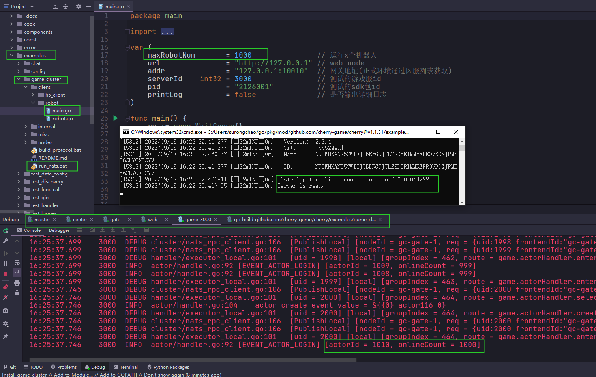

# 分布式多节点示例

- 建议在windows环境进行调试，因项目自带了`nats-server.exe`用于演示项目，其他系统环境请自行搭建nats server
- 建议使用GoLand打开源码
- 本示例没有使用数据库，进程重启后会还原所有数据，主要原因是降低调试时的部署成本
- 本示例使用go版本的客户端sdk，连接类型为`tcp`，序列化类型为`protobuf`

## 要求

- 安装GO版本 >= 1.17
- 安装nats.io >= 2.0

## 操作步骤

### 克隆

- `git clone https://github.com/cherry-game/cherry.git`
- 或者通过github页面点击`code`按钮`Download zip`下载源码包的方式进行

### 调试

#### 0x00 打开项目

> 使用GoLand打开项目源码，找到`examples/game_cluster`目录，并点击打开

#### 0x01 启动nats server

> nats为高性能的分布式消息中间件，详情可通过`https://github.com/nats-io/nats-server` 进行了解 \
> 本框架中所有节点都基于nats进行消息通信 \
> 单机版nats执行程序在`examples/game_cluster/misc/nats-server`目录中 \
> 正式环境请使用集群nats部署

- 以下为操作步骤:
- 找到`run_nats.bat`，右键点击`Run cmd script`运行单机版`nats`
- 窗口显示`Listening for client connections on 0.0.0.0:4222` 代表nats启动成功，nats默认监听`4222`端口

#### 0x02 启动master节点

> master节点主要用于实现最基础的发现服务,基于nats构建 \
> 正式环境也可配置为etcd方式提供发现服务 \
> 相关的代码在`examples/game_cluster/master/`目录

- 以下为操作步骤:
- 找到`exmaples/game_cluster/nodes/main.go`，该文件为本示例的main函数，所有项目都从此处启动
- 点击`func main() {`左边的绿色三角形，选择`Debug ...`运行本函数
- 此时master节点启动失败。从`Console`窗口可以看到需要传入参数
- 点击 `Edit Configurations...` 找到`Program arguments:`选项，配置参数为:`master --name=gc --node=gc-master`
- `master` 代表运行master节点，详情看`main.go:87`行
- `--name=gc` 代表选择`profile-gc.json`的环境配置参数
- `--node=gc-master` 代表master节点启动时，读取`profile-gc.json`文件中`"node_id": "gc-master"`的环境配置
- 点击`ok按钮`，继续启动调式。当`Console`窗口显示`application is running.`字样时，表示master节点启动成功
- 如果`Console`窗口显示`nats connect fail! retrying in 3 seconds.` 则表示本地没有启动成功nats

#### 0x03 启动center节点

> center节点目前主要用于处理帐号相关的业务或全局唯一的业务

- 以下为操作步骤:
- 按照`master`的启动方式，再复制一个配置项 `Copy Configurations`，并配置启动参数
- 找到`Program arguments:`选项，配置参数为:`center --name=gc --node=gc-center`

#### 0x04 启动web节点

> web节点主要对外提供一些http的接口，可横向扩展，多节点部署 \
> 目前用于开发者帐号注册、区服列表、sdk登陆/支付回调、验证token生成等业务

- 以下为操作步骤:
- 按照`master`的启动方式，再复制一个配置项 `Copy Configurations`，并配置启动参数
- 找到`Program arguments:`选项，配置参数为:`web --name=gc --node=gc-web-1`

#### 0x05 启动gate节点

> gate节点为游戏对外网关，可横向扩展，多节点部署 \
> 主要用于管理客户端的连接、消息路由与转发

- 以下为操作步骤:
- 按照`master`的启动方式，再复制一个配置项 `Copy Configurations`，并配置启动参数
- 找到`Program arguments:`选项，配置参数为:`gate --name=gc --node=gc-gate-1`

#### 0x06 启动game节点

> game节点为具体的游戏逻辑业务，根据业务需求可多节点部署 \
> 在分服的游戏中可提供游戏内的各种逻辑实现

- 以下为操作步骤:
- 按照`master`的启动方式，再复制一个配置项 `Copy Configurations`，并配置启动参数
- 找到`Program arguments:`选项，配置参数为:`game --name=gc --node=3000`

### 测试

- 使用golang实现客户端，通过tcp协议连接gate网关进行压力测试
- 使用h5客户端，通过websocket协议连接gate网关进行功能的展示

#### 启动压测机器人

- 找到`examples/game_cluster/client/robot/main.go` 文件,并执行
- 机器人执行逻辑为：注册帐号，登陆获取token、连接网关、用户登录游戏服、查看角色、创建角色、进入角色
- 默认设定为创建1000个帐号，可自行调整`maxRobotNum`参数进行测试
- 执行完成后，从game节点的`Console`可以查看到`[actorId = 1010, onlineCount = 1000]`字样，代表1000帐号已经进入游戏

### 源码讲解

- `client` 客户端实现
    - h5_client h5客户端(暂未实现)
    - robot go版机器人，用于压测协议

- `internal` 内部业务逻辑
    - `code` 定义一些业务的状态码
    - `component` 组件目录，
        - `check_center`组件, 用于在启动前节点先检查`center`节点是否已启动
    - `constant` 一些常用定义
    - `data` 策划配表包装的struct，用于读取`../../config/data`目录的策划配表
    - `event` 游戏事件
    - `guid` 生成全局id
    - `pb` protobuf生成的协议结构
    - `protocol` protobuf结构定义目录
    - `rpc` 跨节点rpc函数封装
    - `session_key` 一些session相关的常量定义
    - `token` 登录token逻辑，包含生成token、验证token
    - `types` 各种自定义类型封装,方便struct从配置文件、数据库读取数据时进行序列化、反序列化

- `misc` 杂项目录
    - `nats-server` nats服务端程序(生产环境请使用集群版nats)

- `nodes` 分布式节点目录
    - `center`节点
    - `game` 节点
    - `gate` 节点
    - `master` 节点
    - `web` 节点

- `build_protocol.bat` 生成protobuf结构代码到`internal/pb/`目录
- `run_nats.bat` 运行nats服务端的快捷脚本

### 配置

- 本示例使用的profile环境配置文件在`examples/config/profile-gc.json`
- 本示例读取的策划配置文件在 `examples/config/data/`

### 运行截图

